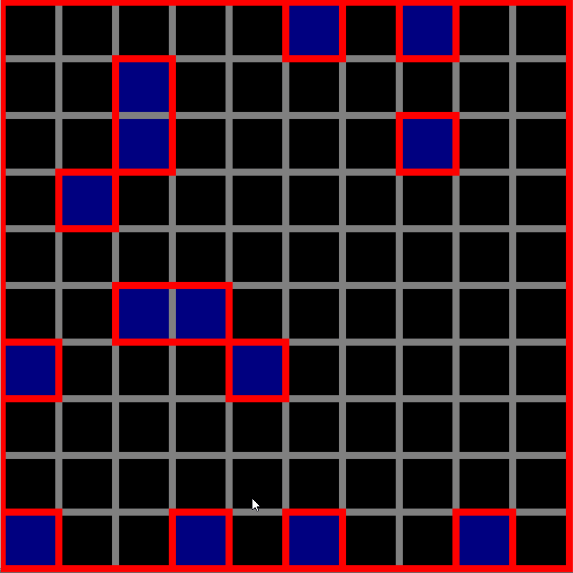

# Polygonization
Converting a collection of tiles into a polygonal mesh

This was a simple project which was really just an excuse to
 - Practice using classes in C++
 - Try out using the "olcPixelGameEngine" by David Barr ([available here](https://github.com/OneLoneCoder/olcPixelGameEngine)) as a potential go-to casual and hassle-free graphics platform for future projects
 - Practice using the inbuilt Git version control abilities of Visual Studio
 - Prepare for some more ambitions 3D meshing projects in the future

But thats enough meta, onto the project.



What is it?
------

This program will, given a collection of tiles on a grid, merge the squares together to form the minimum possible amount of polygons, which are then outlined in red. This is effectively a very primitive form of a "meshing" algorithm, commonly used in computer graphics work. My algorithm is just a toy really, and has many failings compared to a proper industry approach.
For example:
 - Everything is squares! This is a laughable oversimplification of what most people would consider a meshing algorithm, and makes a lot of things very easy.
 - The polygons are stored as a collection of lines, and have no concept of which direction they are facing (eg: a south wall, or an east wall, etc). This is fine and doesn't lead to any missing edges (just think about it), however it precludes the application of any automatic culling optimisations one might want to make. For example, if this was used as a raytracer like in [one of my earlier projects](https://github.com/Antiochian/2D-shadow-casting) then one might be tempted to do something like ```if player is facing south, dont bother checking north-facing sides for collisions ``` to save on computation. This approach is impossible due to the way I set up my data structures.
 - Every single possible tile, even empty spaces, is stored as a cell object, which means that a 100,000x100,000 grid with only a single small square on it would still be just as computationally expensive as if it was covered in an intricate and complex pattern. However this program is so fast and lightweight that this is pretty much unnoticeable in any practical sense.
